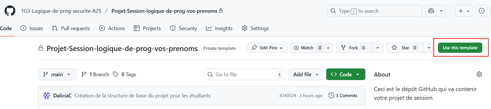

**Veuillez noter qu'il y'a un tableau de distribution de tâche à remplir impérativement avant de commencer à coder. Celui-ci peut-être mis à jour. Aucune correction ne sera faite si ce n'est pas rempli.**

# Description 
_[Écrire une description de votre projet ici. Vous pouvez le mettre à jour si les fonctionnalités changent.]_

# Instruction pour le projet d’équipe
## Objectif du projet
En plus de pratiquer les notions de programmation vues durant la session, ce projet vous permet d’apprendre à travailler en équipe, 
en utilisant plusieurs fichiers appelés **modules**.
Chaque membre de l’équipe crée et teste son propre module, puis toutes les parties sont réunies dans un seul programme principal.

## Faire votre copie du projet 
Faire une copie de ce projet en cliquant sur _Use this template_ et le renommer en ajoutant vos prénoms. Exemple : _Projet-logique-de-prog-dalicia-maryse-hasna_




**Me donner les droits d'accès (voir les notes de cours).**

## Structure du projet
Voir la structure du projet fourni et lire les instructions sur l'image.


## Contenus des fichiers
Les descriptions des contenus des fichiers se trouvent aussi en commentaires dans chaque fichier.

### 1. Les modules (`nom_projet/`)
Chaque étudiant a (au moins) **un fichier (module)** qui contient ses fonctions. C’est là que le travail personnel de l'étudiant doit être mis.
- Les fichiers doivent être renommés avec des noms de modules, exemples : generation_mots_de_passes.py, gestion_mots_de_passes.py, etc.
Il est important de bien choisir son ou ses noms de modules selon les fonctions qui s'y trouvent.
- Modifiez les noms d'auteurs dans vos modules.
- **Important : Si vous modifiez les fichiers d'un autre membre, pour y créer une fonction par exemple, écrivez votre nom d'auteur juste au-dessus de la fonction créée ou modifiée.**
```
"""
Auteur : Votre Nom
Créé le: ...
"""
```
### 2. Les tests unitaires (`tests_nom_projet/`)
Pour chaque module, on a un fichier de tests unitaires.
- Les fichiers de tests doivent être renommés selon vos noms de modules. Exemples: tests_generation_mots_de_passes.py, tests_gestion_mots_de_passes.py, etc.

### 3. Le fichier principal `__main__.py`
Ce fichier est le point de départ de tout le projet.
C’est ici que les différents modules sont utilisés ensemble. On y trouve :
- L'importation des fonctions de tous les modules. 
- L’intégration de toutes les parties du projet :
  - Les appels aux fonctions des modules.
  - Autres instructions utiles dans votre projet. Par exemple, un menu pour les différentes fonctionnalités de votre application.
### 4. Autres fichiers
Ajoutez au besoin d'autres fichiers, par exemple : vos fichiers markdown (.md) contenant vos plans de tests, vos fichiers de pseudo-code ou vos fichiers ou images contenant vos organigramme (schéma).

# Travail d'équipe et répartition des tâches
Chaque membre de l'équipe doit s'impliquer dans la programmation des différentes notions vues en classe : chacun doit créer des fonctions, intégrer son travail dans le programme principal, faires des tests unitaires, etc. **Exemple de ce qui n'est pas accepté** : Un étudiant créé toutes les fonctions, un autre créé le programme principal et un autre créé les tests unitaires.

## Répartition des tâches
- Discutez en équipe pour savoir qui travaille sur quoi, puis remplissez ce tableau. 
- Mettez-le à jour si vos tâches changent.

| Tâche | Nom étudiant 1 | Nom étudiant 2 | Nom étudiant 3 | Détails/Commentaires                                            |
|-------|----------------|----------------|----------------|-----------------------------------------------------------------|
|       | X              |                |                |                                                                 |
|       |                | X              | X              | Étudiant x a modifié le code de y pour adapté la fonction à ... |
|       |                |                |                |                                                                 |
|       |                |                |                |                                                                 |
|       |                |                |                |                                                                 |
|       |                |                |                |                                                                 |
|       |                |                |                |                                                                 |

# Notes
- L'enseignante peut vous convoquer dans les 2 semaines suivant la remise de votre projet pour vous poser des questions afin de clarifier certains aspects de votre projet.

# Gestion travail d'équipe dans Git
## 1.Récupérer le travail de ton équipe (Pull)
Voir les [notes de cours](https://projets420.gitbook.io/notes-de-cours/git-systeme-de-gestion-de-versions/introduction-a-git-1#recuperer-les-changements-dans-github-pull) pour voir comment récupérer les changements sur GitHub avec _pull_.

## 2. La gestion des conflits Git
Voir les [notes de cours](https://projets420.gitbook.io/notes-de-cours/git-systeme-de-gestion-de-versions/introduction-a-git-1#la-gestion-des-conflits-git).

**Astuce : les conflits arrivent souvent quand on oublie de faire un Pull avant de commencer à coder.
Pense à le faire systématiquement avant de commencer chaque séance de travail.**

## 3. Enregistrer et envoyer son travail (Commit & Push)
Voir les [notes de cours](https://projets420.gitbook.io/notes-de-cours/git-systeme-de-gestion-de-versions/introduction-a-git-1#add-commit-et-push-dans-pycharm).
Quand tu as terminé une fonctionnalité ou que tu as avancé ton travail, fais un commit et push (voir les notes de cours).

**Conseil : Fais des petits commits réguliers, plutôt qu’un seul gros à la fin.**

# Conseils de collaboration
- Créez les tests unitaires pour vos fonctions avant de les partager. Celà permet à vos co-équipiers de les lancer pour s'assurer qu'ils n'ont pas introduit d'erreurs dans ton code.
- Faites un “Pull” pour récupérer les changements récents avant de commencer et un “Push” après ton travail.
- Soyez clairs dans vos messages de commit : cela aidera tout le monde à suivre.
- Ne modifiez pas le code des autres sans leur accord.
- Travaillez ensemble pour décider de l’ordre des appels dans `__main__.py`.


